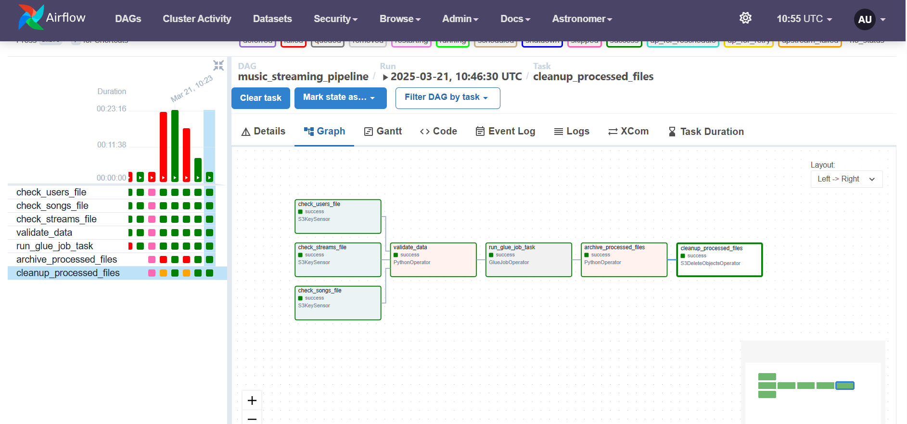

# Real-Time Music Streaming Analytics Pipeline 🎵

A scalable ETL pipeline that processes streaming music data to compute daily KPIs using AWS services and Apache Airflow.

## 🎯 Overview

This pipeline processes real-time music listening data to generate actionable insights including top songs, popular genres, and user engagement metrics. Built with cloud-native services, it ensures reliability, scalability, and automated processing.

## 🏗️ Architecture


### Data Flow

1. **Ingestion**: Raw streaming data → Amazon S3
2. **Validation**: Schema validation & data quality checks
3. **Processing**: AWS Glue transforms data & computes KPIs
4. **Storage**: Results → DynamoDB for fast retrieval



## 🔑 Key Features

- **Real-Time Processing**: Handles streaming data as it arrives
- **Automated Workflow**: Fully orchestrated with Apache Airflow
- **Data Quality**: Built-in validation and error handling
- **Scalable**: Cloud-native architecture using AWS services
- **Observable**: Comprehensive logging and monitoring
- **Maintainable**: Modular design with clear separation of concerns

## 📊 Computed KPIs

| KPI | Description |
|-----|-------------|
| Listen Count | Total plays per genre/day |
| Unique Listeners | Distinct users per genre/day |
| Listening Time | Total & average duration metrics |
| Top Songs | Most popular tracks by genre |
| Top Genres | Trending genres by day |

## 🛠️ Tech Stack

- **Apache Airflow**: Workflow orchestration
- **AWS Glue**: Data transformation (PySpark)
- **Amazon S3**: Data lake storage
- **Amazon DynamoDB**: KPI storage
- **Python**: Core programming language

## 📦 Project Structure

```
.
├── dags/                  # Airflow DAG definitions
│   └── etl_v1.py         # Main ETL pipeline
├── plugins/              
│   └── helpers/          # Custom utilities
│       └── validation.py # Data validation logic
│       └── transform.py  # Data processing logic
│       └── archiving.py  # Data archiving logic
├── notebooks/            # Jupyter notebooks
│   └── mySpark_KPIs.ipynb # Development & testing
|   └── Glue-Stream-KPI-Job.py # Glue job for KPI computation
├── docs/                 # Documentation
|   └── source/           # Sphinx source files
|       └── index.rst     # Main documentation page
└── tests/                # Test suite
|   └── dags/             # DAG tests
|       └── test_data_processing.py # Data processing tests
└── requirements.txt      # Python dependencies

```

## 🚀 Getting Started

1. **Prerequisites**
   ```bash
   - Python 3.8+
   - Apache Airflow
   - AWS Account
   - Docker & Docker Compose
   ```

2. **Installation**
   ```bash
   # Clone repository
   git clone [repository-url]

   # Install dependencies
   pip install -r requirements.txt

   # Set up environment variables
   cp .env.example .env
   # Edit .env with your AWS credentials
   ```

3. **Running Locally**
   ```bash
   # Start Airflow
   astro dev start
   ```

4. **Access**
   - Airflow UI: http://localhost:8080
   - Default credentials: admin/admin

## 📝 Required Data Schema

### Users Table
- `user_id` (string)
- `user_name` (string)
- `user_age` (integer)
- `user_country` (string)
- `created_at` (timestamp)

### Songs Table
- `track_id` (string)
- `track_name` (string)
- `artists` (string)
- `album_name` (string)
- `track_genre` (string)
- `duration_ms` (integer)
- `popularity` (integer)
- `explicit` (boolean)

### Streams Table
- `user_id` (string)
- `track_id` (string)
- `listen_time` (timestamp)

## 🔍 Monitoring & Maintenance

- Monitor Airflow logs for task status
- Check S3 error/ folder for invalid files
- Review archived data periodically
- Update AWS credentials as needed

## 🛡️ Error Handling

- Failed validations → files moved to error/
- Comprehensive error logging
- Configured task retries
- Alert notifications for critical failures

## 🔜 Future Improvements

- [ ] Unit tests for KPI calculations
- [ ] API Gateway + Lambda for real-time KPI access
- [ ] Hourly KPI computation support
- [ ] Enhanced monitoring dashboards
- [ ] Data quality metrics tracking

## 📄 Documentation

Detailed documentation is available in the `docs/` directory. To generate:

```bash
./build_docs.sh
# Open docs/build/html/index.html in browser
```

## 🤝 Contributing

1. Fork the repository
2. Create feature branch
3. Commit changes
4. Push to branch
5. Open pull request

## 📜 License

This project is licensed under the MIT License - see the LICENSE file for details.

## 👥 Contact

For questions or feedback, please reach out to [Your Contact Information]

